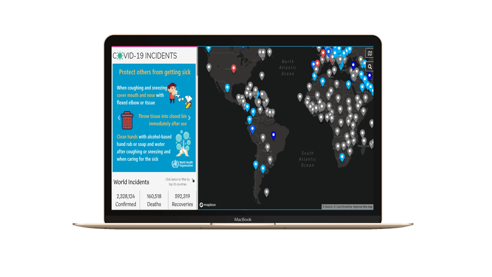
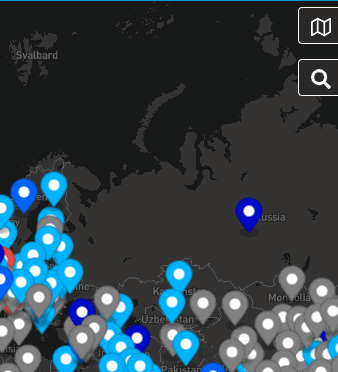

<h1 align="center">
    
</h1>
<h4 align="center">
     
       Covid-19 Tracker 
    
</h4>

  <a href="#rocket-tecnologias">Tecnologias</a>&nbsp;&nbsp;&nbsp;|&nbsp;&nbsp;&nbsp;
  <a href="#-projeto">Projeto</a>&nbsp;&nbsp;&nbsp;|&nbsp;&nbsp;&nbsp;
  <a href="#-principais-conceitos-abordados">Conceitos</a>&nbsp;&nbsp;&nbsp;|&nbsp;&nbsp;&nbsp;
  <a href="#-configuração-do-projeto">Configurações</a>&nbsp;&nbsp;&nbsp;|&nbsp;&nbsp;&nbsp;

 

    

<h1 align="center">
    
</h1>

## :rocket: Tecnologias

- [ReactJS](https://reactjs.org)
- [React Bootstrap](https://react-bootstrap.github.io/)
- [Axios](https://www.npmjs.com/package/axios)
- [Context API](https://pt-br.reactjs.org/docs/context.html)
- [Covid-19 API](https://github.com/mathdroid/covid-19-api)
- [Mapbox](https://www.mapbox.com/)

## 💻 Projeto

- Aplicação que mapeia localização do Covid-19, assim como valores de casos confirmados, de mortes e de curados ao redor do mundo e em países específicos.

## 📚 Principais conceitos abordados

- Consumir um API
- Busca pelas rotas
- Manipulação de dados JSON
- Context API

## 🤔 Configuração do projeto

- Clone o repositório
- Instale as <a href="#bookmark_tabs-possíveis-dependências-e-frameworks">dependências</a> necessárias
- Execute 'npm start' ou 'yarn start' no terminal
<!-- - Ou clique no link abaixo se deseja apenas visualizar a aplicação :smile:
  
:point_down:**Link da aplicação hospedada no Firebase** :point_down:

 [Weather App](https://weatherapp-559f6.firebaseapp.com/) -->

<h1></h1>

## :bookmark_tabs: Possíveis dependências e frameworks

- [Axios](https://www.npmjs.com/package/axios) ( *npm install axios / yarn add axios* )

- [React router dom](https://reacttraining.com/react-router/web/guides/quick-start) ( *npm install react-router-dom / yarn add react-router-dom* )

- [Mapbox](https://www.mapbox.com/install/js/) ( *npm install mapbox-gl --save*)

- [React icons](https://react-icons.netlify.com/#/) (  *npm install react-icons --save / yarn add react-icons* )

- [React Bootstrap](https://react-bootstrap.github.io/getting-started/introduction/) ( *npm install react-bootstrap bootstrap / yarn add react-bootstrap bootstrap* )

- [React Number Format](https://www.npmjs.com/package/react-number-format) ( *npm install react-number-format --save*)

